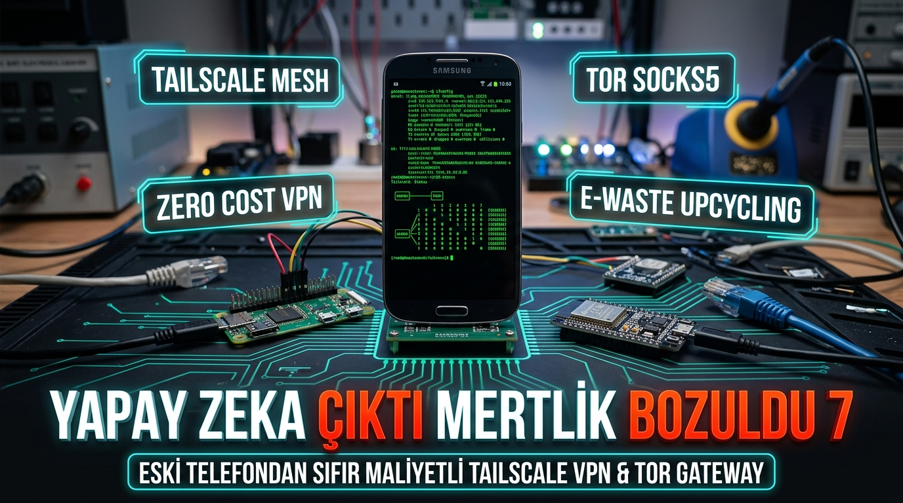
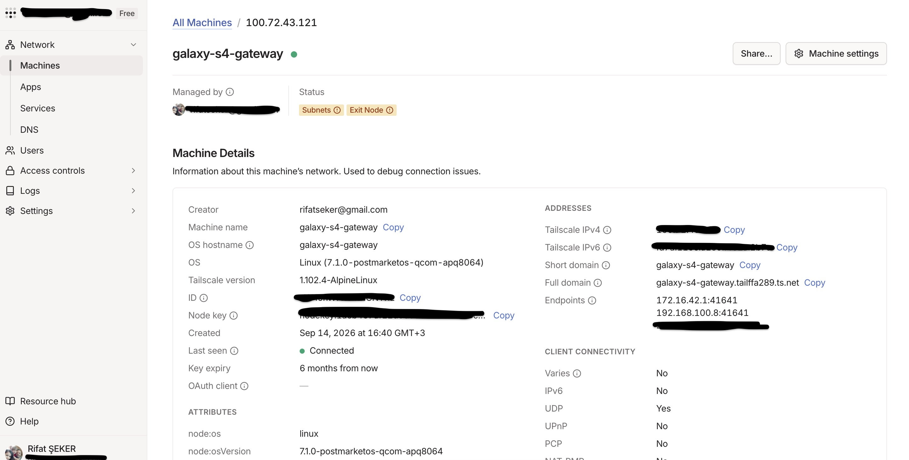
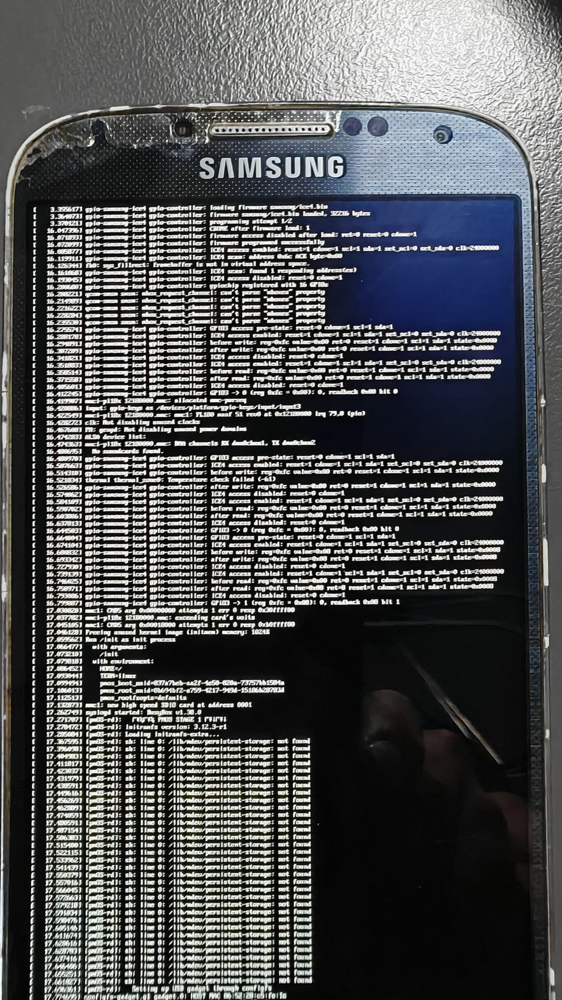

<div align="center">
  
</div>

<br />

[](https://opensource.org/licenses/MIT)
[](https://postmarketos.org/)
[](https://kernel.org/)
[](https://tailscale.com/)
[](https://torproject.org/)
[](#-yeşil-dönüşüm-ve-sürdürülebilirlik-etkisi)

---

## 📸 Canlı Donanım ve Sistem Görüntüleri

<div align="center">
  
  
  <p><em>Fotoğraflar: Samsung Galaxy S4 üzerinde postmarketOS (Alpine Linux) ve Framebuffer Konsolunun fiziksel AMOLED ekrandan canlı görüntüleri (<code>samsung-jflte login:</code>).</em></p>
</div>

---

## 📌 Proje Nedir ve Neden Yapıldı?

**TailGreen**, çekmecelerde unutulmuş ya da elektronik atık (E-Waste) olarak çöpe gitmeye terk edilmiş eski bir akıllı telefonu (**Samsung Galaxy S4 GT-I9505**); 
- **Dahili kesintisiz güç kaynağı (UPS / Batarya)**,
- **4 çekirdekli Qualcomm işlemci**,
- **2 GB LPDDR3 RAM**,
- **Dahili Wi-Fi & 4G LTE modem** ve
- **Fiziksel AMOLED bilgi ekranı**  
içeren, 7/24 kesintisiz çalışan, sıfır maliyetli bir **Kurumsal VPN Gateway & Tor Gizlilik Köprüsü**'ne dönüştüren açık kaynaklı bir **Yeşil Dönüşüm (E-Waste Upcycling)** projesidir.

---

## 🎯 Teknik Olarak Ne Amaçla Yapıldı?

Geleneksel olarak dışarıdan bir yerel ağa (ofis, ev veya veri merkezi) güvenle bağlanabilmek için:
1. Pahalı kurumsal VPN yönlendiricileri (Cisco, Fortinet, pfSense veya Raspberry Pi kitleri) satın almak,
2. İnternet servis sağlayıcılarına her ay **Statik IP ücreti** ödemek,
3. Elektrik kesintilerine karşı harici akü/UPS donanımı kurmak,
4. Karmaşık port yönlendirme (Port Forwarding) ve CGNAT sorunlarıyla uğraşmak gerekiyordu.

**TailGreen ile:**
- Telefon Android işletim sisteminden tamamen arındırıldı ve saf **postmarketOS (Alpine Linux)** kuruldu.
- Çekirdek seviyesinde **WireGuard** ve **Tailscale** entegre edilerek port açma ihtiyacı ortadan kaldırıldı (CGNAT Bypass).
- `--advertise-exit-node` ve `--advertise-routes=192.168.1.0/24` yetenekleri kazandırılarak cihaz **Yerel Ağ Geçidi (Subnet Router)** yapıldı.
- **Tor SOCKS5 Proxy** entegre edilerek halka açık güvensiz Wi-Fi ağlarında %100 iz bırakmayan şifreli gezinme sağlandı.
- Grafik arayüzler kaldırılarak sistem **saf TTY / Framebuffer konsoluna** bağlandı; minimum enerji tüketimi (~2W) ve maksimum kararlılık elde edildi.

---

## 🖥️ Yerel Sunucu Derleme ve Flaşlama Mimarisi (Mühendislik Notu)

Bu projenin hayata geçirilmesinde karşılaşılan ve aşılan en önemli teknik engel:
- **macOS Fastboot AVB Tuzağı:** macOS üzerindeki modern Android Platform-Tools (Fastboot v35+), `userdata` bölümüne ham Linux imajı yazarken Android Verified Boot (AVB) footer hatası vererek süreci kilitliyordu.
- **Yerel Linux Sunucusu Çözümü:** Süreç doğrudan yerel ağdaki bir **Ubuntu/Debian Linux Sunucusuna** taşındı.
  1. `pmbootstrap` chroot ortamında 2.9 GB'lık saf MBR disk imajı derlendi.
  2. Telefon Download modunda sunucunun USB'sine takılarak `heimdall flash --BOOT lk2nd.img` ile ikincil bootloader yüklendi.
  3. Cihaz `lk2nd` fastboot modundayken Debian `fastboot v34.0.4` ile 2.9GB rootfs sparse formatında 3 parçada (784MB + 774MB + 80MB) telefona başarıyla aktarıldı.
  4. Sunucuya `/etc/udev/rules.d/99-phone-usb.rules` kuralı eklenerek, telefon USB'den bağlandığı anda sunucu ile cihaz arasında otomatik yerel USB ağ köprüsü kurulması ve doğrudan SSH erişimi sağlandı.

> 📖 Tüm derleme komutları, Heimdall adımları ve hata çözümleri için [docs/INSTALLATION.md](docs/INSTALLATION.md) belgesini inceleyebilirsiniz.

---

## 🔌 Donanımsal Kurtarma Anahtarı (OOB Rescue Dongle)

Bu cihazın en kritik özelliklerinden biri taşınabilir **"Donanımsal Arka Kapı / Kurtarma Cihazı (Out-of-Band Management)"** olarak çalışabilmesidir:
- İnternete çıkışı olmayan veya VPN kurulamayan kilitli bir sunucunun USB portuna bu telefonu taktığınız anda;
- Sunucu telefonu anında bir **USB Ağ Kartı (`cdc_ncm`)** olarak görür.
- Telefon kendi Wi-Fi veya SIM kartı üzerinden Tailscale ağına bağlı kalır.
- Siz dünyanın öbür ucundan Tailscale üzerinden telefona, telefon üzerinden de USB ile bağlı sunucuya **anında SSH veya Uzak Masaüstü** yapabilirsiniz!

---

## 🌍 Yeşil Dönüşüm ve Sürdürülebilirlik Etkisi

Dünya genelinde yılda **50 milyon tonu aşkın e-atık** üretilmektedir. Akıllı telefonların çoğu donanımları bozulduğu için değil, üreticilerin planlı eskitme (planned obsolescence) politikalarıyla yazılım desteğini kesmesi yüzünden çöpe gitmektedir.

| Karşılaştırma | Yeni Ağ Cihazı / Mini PC | TailGreen (Galaxy S4) | Kazanç |
| :--- | :--- | :--- | :--- |
| **Donanım Maliyeti** | $100 - $350 | **$0 (Atıl cihaz kullanıldı)** | **%100 Tasarruf** |
| **Üretim Kaynaklı Karbon (Embodied CO₂)** | ~40 kg CO₂e | **0 kg CO₂e** | **Sıfır Yeni Emisyon** |
| **Enerji Tüketimi (7/24)** | 10W - 25W | **~2W - 3W** | **%80 Enerji Tasarrufu** |
| **Kesintisiz Güç Kaynağı** | Ayrı UPS Gerekir (~$80) | **Dahili Batarya (UPS)** | **Dahili Koruma** |

---

## 👥 Bu Projenin Kime Ne Faydası Var?

1. **Sistem Yöneticileri & DevOps Mühendisleri:**  
   Ceplerinde taşıyabilecekleri, sahada internetsiz bir sunucuya USB'den taktıkları anda acil uzaktan erişim sağlayan bir "Donanımsal OOB Kurtarma Aracı".
2. **KOBİ'ler ve Ofisler:**  
   Statik IP parası vermeden ve pahalı firewall kutuları almadan ofis içi sunuculara ve kamera sistemlerine dışarıdan şifreli erişim.
3. **Öğrenciler ve Yazılımcılar:**  
   Evdeki masaüstü bilgisayarlarına veya geliştirme ortamlarına okuldan/kafeden sıfır maliyetle bağlanabilme imkanı.
4. **Gizlilik Odaklı Kullanıcılar:**  
   Havalimanı, otel ve kafelerde güvensiz ağlara bağlanırken tüm trafiği ev/ofis üzerinden Tor ağıyla şifreleyerek çıkarma güvenliği.

---

## 🛠️ Hızlı Kurulum

Detaylı adım adım adımlar için [docs/INSTALLATION.md](docs/INSTALLATION.md) belgesini inceleyebilirsiniz.

```bash
# 1. Depoyu klonlayın
git clone https://github.com/rifatsekerariot/tailgreen.git
cd tailgreen

# 2. Telefonda TTY konsol modunu etkinleştirin (Arayüzsüz)
sudo sh scripts/setup-tty-console.sh

# 3. Tailscale ve Subnet Routing kurun
sudo sh scripts/setup-tailscale.sh

# 4. Tor SOCKS5 anonimleştirme servisini başlatın
sudo sh scripts/setup-tor.sh
```

---

## 📱 Desteklenen Donanımlar & Alternatif Cihazlar

TailGreen mimarisi sadece Samsung Galaxy S4'e özgü değildir; elinizdeki pek çok farklı atıl veya gömülü donanımda hayata geçirilebilir:

| Cihaz Grubu | Örnek Donanımlar | Rol ve Yetenek |
| :--- | :--- | :--- |
| **Eski Akıllı Telefonlar (En İyisi)** | Samsung S3/S4/S5, Nexus 4/5, Xiaomi Redmi 2/4X | 7/24 Kesintisiz Pilli Gateway, Donanımsal Ekran, 4G LTE |
| **Mini SBC (Tek Kart PC)** | **Raspberry Pi Zero W / Zero 2 W** | Cep boyutu USB Kurtarma Dongle'ı (OTG Gadget Ethernet) |
| **Standart SBC'ler** | Raspberry Pi 3/4/5, Orange Pi Zero 2/3 | Sabit Ofis/Ev Ağ Geçidi |
| **Eski Android TV Box'lar** | Amlogic S905/S912 işlemcili kutular (Armbian) | Kablolu Ethernet Gateway |
| **Mikrodenetleyiciler (MCU)** | **ESP32, ESP32-S3** | Hafif Gömülü WireGuard İstemcisi & IoT Sensör Düğümü |

> 📖 Detaylı donanım karşılaştırma matrisi, ESP32 gömülü WireGuard senaryoları ve Pi Zero konfigürasyonları için [docs/COMPATIBLE_DEVICES.md](docs/COMPATIBLE_DEVICES.md) kılavuzunu inceleyebilirsiniz.

---

## 📚 Dokümantasyon

- 📱 [Desteklenen Cihazlar & Donanım Rehberi (COMPATIBLE_DEVICES.md)](docs/COMPATIBLE_DEVICES.md)
- 🛠️ [Adım Adım Kurulum Rehberi (INSTALLATION.md)](docs/INSTALLATION.md)
- 📐 [Sistem ve Ağ Mimarisi (ARCHITECTURE.md)](docs/ARCHITECTURE.md)
- 🌱 [E-Atık ve Sürdürülebilirlik Raporu (GREEN_IMPACT.md)](docs/GREEN_IMPACT.md)
- 💼 [Kullanım Senaryoları & İş Modelleri (USE_CASES.md)](docs/USE_CASES.md)

---

## 🤝 Katkıda Bulunma ve Lisans

Bu proje, açık kaynak ve yeşil bilişim ilkeleri doğrultusunda [MIT Lisansı](LICENSE) ile lisanslanmıştır. Eski cihazlarınızı çöpe atmayın, Linux ile hayata döndürün! 🌱
